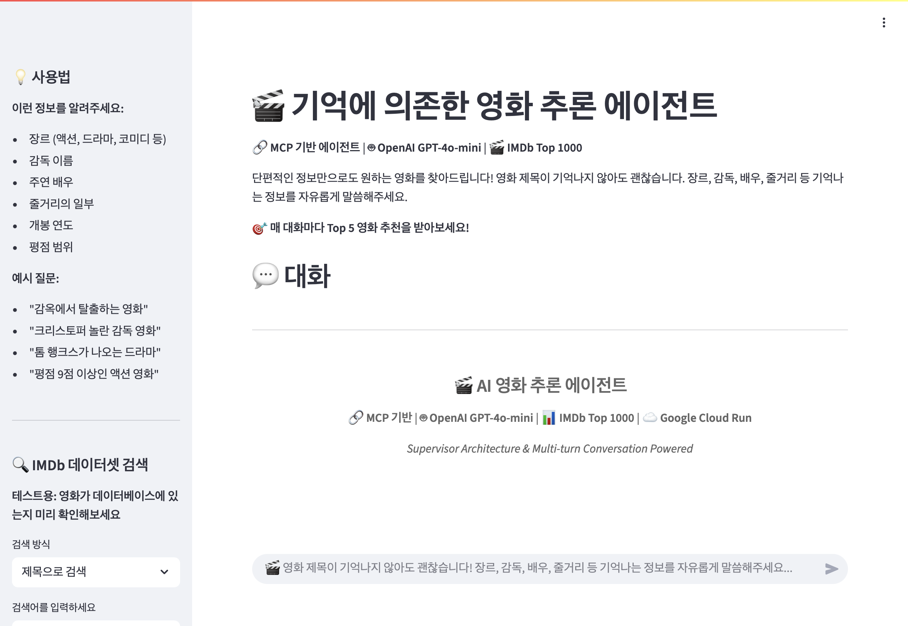
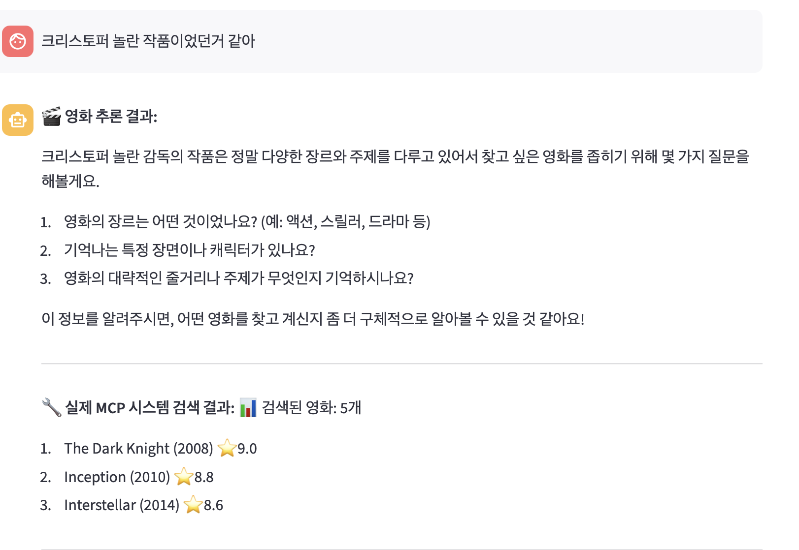
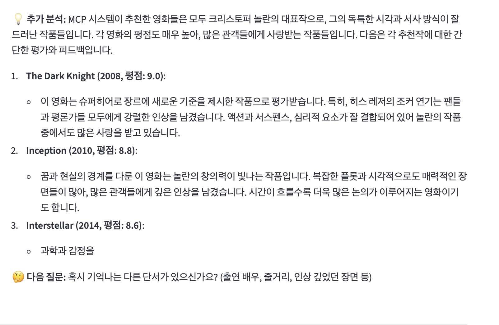

# 서비스 url
[https://movie-agent-real-mcp-904447394903.us-central1.run.app](https://movie-agent-real-mcp-904447394903.us-central1.run.app)


api 자원 소진으로 인하여 작동이 읜도되로 되지 않을 수 있습니다.
본인의 api 키로 직접 테스트 해 보세요!

# 🎬 AI Movie Finder

영화 추론 에이전트를 통해 단편적인 정보만으로도 원하는 영화를 찾을 수 있습니다. MCP(Model Context Protocol) 기반으로 구축된 지능형 영화 검색 시스템입니다.

## ✨ 주요 기능

- **🧠 지능형 영화 추론**: 부분적인 정보만으로도 영화 추천
- **🔗 MCP 기반 아키텍처**: 확장 가능한 에이전트 시스템
- **🎯 다중 검색 소스**: IMDb Top 1000 + 웹 검색 통합
- **🤖 AI 모델 지원**: OpenAI GPT-4o-mini, Google Gemini
- **🌐 웹 인터페이스**: Streamlit 기반 사용자 친화적 UI
- **☁️ 클라우드 배포**: Google Cloud Platform 지원

## 🚀 빠른 시작

### 사전 요구사항

```bash
Python 3.8+
```

### 설치

1. 저장소 클론
```bash
git clone https://github.com/your-username/AImoviefinder.git
cd AImoviefinder/mcp_project_main
```

2. 의존성 설치
```bash
pip install -r requirements.txt
```

3. 환경 변수 설정
```bash
cp .env.example .env
```

`.env` 파일에 다음 API 키들을 설정하세요:
```env
OPENAI_API_KEY=your_openai_api_key
GOOGLE_API_KEY=your_google_api_key
TAVILY_API_KEY=your_tavily_api_key
```

4. 애플리케이션 실행
```bash
streamlit run app.py
```

## 🛠️ 기술 스택

- **Backend**: Python, MCP Protocol
- **Frontend**: Streamlit
- **AI Models**: OpenAI GPT-4o-mini, Google Gemini
- **Search**: Tavily Search API
- **Data**: IMDb Top 1000 Dataset
- **Deployment**: Google Cloud Platform, Docker

## 📁 프로젝트 구조

```
mcp_project_main/
├── app.py                      # Streamlit 웹 애플리케이션
├── agent_supervisor.py         # 메인 에이전트 컨트롤러
├── mcp_client.py              # MCP 클라이언트
├── llm_client.py              # LLM 통합 클라이언트
├── movie_data_manager.py      # 영화 데이터 관리
├── tavily_search.py           # 웹 검색 통합
├── dataset/
│   └── imdb_top_1000.csv     # IMDb 영화 데이터
├── requirements.txt           # Python 의존성
├── Dockerfile                # Docker 설정
└── deploy.sh                 # 배포 스크립트
```

## 💡 사용법

### 웹 인터페이스
1. 브라우저에서 `http://localhost:8501` 접속
2. 기억나는 영화 정보를 입력:
   - 장르 (액션, 드라마, 코미디 등)
   - 감독 이름
   - 주연 배우
   - 줄거리의 일부
   - 개봉 연도
   - 평점 범위

### 예시 쿼리
- "감옥에서 탈출하는 영화"
- "크리스토퍼 놀란 감독 영화"
- "2010년대 SF 액션 영화"
- "레오나르도 디카프리오 주연 스릴러"

## 🔧 API 설정

### OpenAI API
1. [OpenAI Platform](https://platform.openai.com/)에서 API 키 발급
2. `.env` 파일에 `OPENAI_API_KEY` 설정

### Google Gemini API
1. [Google AI Studio](https://makersuite.google.com/)에서 API 키 발급
2. `.env` 파일에 `GOOGLE_API_KEY` 설정

### Tavily Search API
1. [Tavily](https://tavily.com/)에서 API 키 발급
2. `.env` 파일에 `TAVILY_API_KEY` 설정

## 🚢 배포

### Docker를 이용한 배포
```bash
docker build -t ai-movie-finder .
docker run -p 8501:8501 --env-file .env ai-movie-finder
```

### Google Cloud Platform 배포
```bash
chmod +x deploy.sh
./deploy.sh
```

자세한 배포 가이드는 `DEPLOYMENT_GUIDE.md`를 참조하세요.

## 🤝 기여하기

1. Fork the Project
2. Create your Feature Branch (`git checkout -b feature/AmazingFeature`)
3. Commit your Changes (`git commit -m 'Add some AmazingFeature'`)
4. Push to the Branch (`git push origin feature/AmazingFeature`)
5. Open a Pull Request

## 📄 라이선스

이 프로젝트는 MIT 라이선스 하에 배포됩니다. 자세한 내용은 `LICENSE` 파일을 참조하세요.

## 📞 연락처

프로젝트 링크: [https://github.com/softkleenex/AImoviefinder](https://github.com/softkleenec/AImoviefinder)


### 아래는 웹사이트 실행 예시입니다

mainpage



### 아래는 크리스토퍼 놀란 감독의 작품 서칭 결과입니다



### 아래는 크리스토퍼 놀란 감독의 작품 서칭 결과에서, gpt와 mcp간의 피드백입니다



### 아래는 Tavily를 통한 웹 서칭 결과입니다.

tavily의 작동방식은 TAVILY_SEARCH_GUIDE.md 에 저장되어있습니다.

mcp의 결과가 3개 이하일때 웹검색을 실행하므로, 
크리스토퍼 놀란 대신 크리스마스 놀란 감독으로 검색 시도하였습니다.


